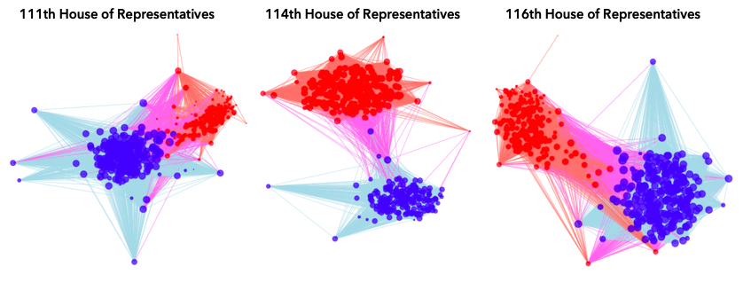

[EXPLAINER NOTEBOOK](https://nbviewer.jupyter.org/github/benedictehejgaard/chaos-in-congress/blob/gh-pages/EXPLAINER_NOTEBOOK.ipynb)
# Using Network Analysis and Natural Language Processing to help you understand the US Congress.

With the 2020 US election being close to finished, we once again find ourselves at the end of a long period of time where US politics has been on everyones lips. But for us Danes, the US political system can seem.. well, quite chaotic? In the light of the recent election, a term you might have heard come across is the United States Congress. Curious to know more about the US Congress - in particular the House of Representatives? Look no further!

On this website, we wish to give you an overview of the voting patterns in the US House of Representatives, and how it has changed over the past 13 years. In the bottom of the page, we will take you through a brief overview of how we found and processed the data, so you have the opportunity to become a US-Congress-Data-Master yourself when you are done reading this website. If you are not interested in the data, and solemnly want to know if there is chaos in congress or not, you can stop before the analysis section and stick to the visual representations of the analyses. Regardless of your technical interest, this website will provide you with answers to questions like: 

- Does polarization exist, and to what degree do the members agree with each other?
- Would a network divide the members into communities corresponding to their political party?
- What subjects separates communities in the House of Representatives? 
- And has this changed over time?

**Intrigued? Keep on reading for insights on our findings!** 

## Navigating the page 
1. [Context and termonology](#Context-and-termonology)
2. [Findings](https://github.com/benedictehejgaard/chaos-in-congress/blob/gh-pages/index.md#findings)
3. [Data Used](#The-Data-Used) 
4. [Network Analysis](#Network-Analysis) (advanced)
5. [Text Analysis](#Text-Analysis) (advanced)
6. [Download the Dataset](#Where-do-I-find-the-data?) 
7. [Download the Entire Workbook](#Where-do-I-find-the-master-notebook-that-rigurously-explains-this-entire-analysis?)
8. [References](#References)

## Context and termonology
Before we get started with the results, we realize not everyone is an expert in the US Congress. If you are, you can skip this section. 

The United States Congress consists of two parts; the house of representatives and the senate. This particular project is solely interested in the house of representatives, which is comprised of 435 members. Each house sits for a 2-year term, after which it is possible to be reelected (as most representatives do). The job of the representatives is to consider bill proposals and amendments in order to introduce new legislation in the United States. Each of these votes is referred to as a roll call and will be uniquely identified by the year and a roll call number (2020-10 will uniquely identify a roll call for example). If a bill is passed in the house of representatives, it is voted on in the senate and finally it is presented to the president. 

We will be analyzing data from term 110-116, hence from 2007-2021 (notice the current term 116 runs from 2019-2021, thus not finialized yet). 

Below, you will find a simple overview of the above described termology: 

| Termonology    | Description                                                    |
|----------------|----------------------------------------------------------------|
| Representative | A voting member of the House of Representatives                |
| Term           | The two year period that the representatives are elected for   |
| Bill/Issue     | The law proposal/amendment that the house votes for            |
| Bill_ID        | Unique ID for each Bill/Issue                                  |
| Roll Call      | A round of voting for a bill. There can be multiple per bill.  |
| Roll_Call_ID   | Unique ID for a roll call.   

## Findings

Please note, a detailed and thorough explanation of the underlying steps, codes and analysis to produce all these findings can be found under [network analysis](#Network Analysis), [text analysis](#Text Analysis) as well at the [explainer notebook](#Where-do-I-find-the-master-notebook-that-rigurously-explains-this-entire-analysis?) (advanced). 

To examine whether polarization exists, we created a network of each representative, based on their voting pattern, using the *ForceAtlas2* library [1]. Each node (the bubble) in the network represents a member of the House in the given term, and each edge (line between bubbles) represents a link between two members. Each time two members have voted *yes* for the same bill, they get a link, meaning that the "weights" each edge have depends on how much each member agress on bills with eachother. The closer two nodes are, the more they agree with eachother. To reduce the density of the network while still remaining all information, we have used two approaces inspired by M. Ángeles Serrano et al. (2009)[2]. Namely, setting a global minimum threshold for edgeweights, and using an algorithm to select significant edges based on edge weights. Please see advanced sections and the explainer notebook for further information. 

In the networks below, Democratic members have blue nodes, and a link between two democratic nodes are correspondingly blue. Republican members have red nodes, and a link between two Republican nodes are correspondingly red. If a Republican and a Democrat have a link between them, the link is colored purple. Below, you will find the generated, finalized networks for terms 111 (2009-2010), term 114 (2015-2016) and term 116 (2019-2021).

In the networks, we clearly see the two distinct parties, with a few outliers. We also notice that term 111 seemed to be less polarized as the nodes are closer, whereas term 114 is more polarized (two more distinct node-centers). Today, we also see two poles, with the democratic members seeming less polarized (more outliers) than the republicans. 

We then examined if we could find any communities within the networks, discarding the political parties. If we were able to find communities within the networks, and see that they were divided based on their political party, this would contribute to our hypothesis that there is polarization in the House. In order to do so, we created partitions/communities in the network in each term (see [Network Analysis](#Network-Analysis) for further details). Furthermore, we calculated a so-called modularity score for each partition, which is a measure of how good the partition is. 

In the figure above, we have displayed the community partitions for terms 111 and terms 114. We have colored the partitions green and purple, and the edges grey if they connect to a node of same partition, and blue if they connect to a node of a different partition. Terms 111 and 114 are interesting in particular, as term 111 saw the lowest modularity score (least polarized) and term 114 saw the highest (most polarized) - which is evident from the plot. 

Lastly, we looked into most frequent words in the summaries that each member votes *yes* to. Below, we show the wordclouds (shaped like the US) of each term for each partition, along with a count of party members is each partition. The larger the word, the more frequent it is. Please see section [text analysis](#Text-Analysis) for further details. 

Below each wordcloud, we will give some insights on trends in each term.

110 (2007-2008) was fairly seprarated. The 2008 Food, Conservation and Energy act, a five-year agricultural bill, was passed, which is evident in partition 1. We see that this partition is highly Republican dominated, which makes sense as we know many states known for farming vote Republicans.

111 (2009-2010) saw lowest modularity. We also see that this is the term where Partition 1 has the most democrats in a republican-dominated partition. Also seems that this term, partition one (republican dominant) is highly concentrated around words from the medical industry, which is a topic that typiaclly divided people. The democratic majority were mostly voting towards bills around wildlife conservation, seen in words like wilderness, rivers, trails, conservation etc. This is most likely due to the 2010 Wildlife Conversation Act.

In 2011-2012 (term 112), Amtrak (American railroad service on the East coast) celebrated their 40th anniversary and announced a large remodeling of their services. This appeared to be a hot topic for the democrats. In the same year, Obama also passed a Free-Trade agreement with Panama and other countries (hot topic for republicans in the wordcloud).

In term 113 (2013-2014) we once again saw a heavy amount of frequent words around farming in the Republican-dominated partition. 2014 is the year where the wildlife act came into force, which appear to be an act that many republicans votes yes for.

In term 114 (2015-2016), the republican-dominant partition was keen on infrastructure (and forests), while the democratic-dominant partition appeared to be keen on academics.

In term 115 (2017-2018), a new president was put into office. While agricultural terms were still a hot topics for the republican-dominant partition, the Office of International Regulatory Affairs (OIRA) was the dominant term. The democratic-dominant partition appeared to be keen on construction and the financial year of 2019 (FY2019).

In term 116 (2019-2020), we notice even more international regulatory arrairs, as well as the rise of the Coronavirus pandemic. Words like "Taiwan", "hong kong", as well as the Customs and Boarder Control (cbc) were hot topics in the Republical party, while the topics of the democratic party was more spread out.

While there are no clear voting patterns to be drawn from the wordclouds, we do notice that the agricultural sector seemed to be a hot topic in the republican-dominated partitions. 

It is important to keep in mind that while we were able to perform text analysis and determine what words were frequent in the bills that each partition voted towards, this analysis will not be sufficient evidence to confirm where there is a clear polarization in the parties. While we were able to see some trends, due to the nature of the analysis, these words are not necessarily those that separate the waters for each partition. For example, we know that the political parties have very different views on taxes. However, they could both be voting for a bill that lowers taxes and a bill that raises taxes, hence the word "taxes" would likely be removed.

## The Data Used 

If you wish to dive deeper into the analyses behind these findings, you will first need some data. In order to carry out these investigations, you will need four datasets: 
* Congress_110_116: Congress Member Data
* roll_info: Roll Call Data
* issue_info: The summary for each bill/issue
* roll_call_vote: The result of each Roll Call voting round 

Each of these datasets contain data from the [US Congress Website](www.congress.gov). If you are curious to know exactly how we got the data, you can find a more throrough walk-through in our [webscraping notebook](https://nbviewer.jupyter.org/github/benedictehejgaard/chaos-in-congress/blob/gh-pages/Scraping_Congress.ipynb) that explains how we carried out the scrape. The data is available at the bottom of the page. 

**Congress_110_116: Congress Member Data**

We use the dataset Congress_110_116 to gain an overview of all the members of the House of Representatives from terms 110-116. With the unique member_ID as a key, it contains information over the members of the congress since 2007, their political party, state, a URL to their website, and much more.

There are 435 members of the House of Representatives. It is to be noted that members do not necessarily sit in the house for the full period. We have a total of 969 members in the dataset – 500 republicans, 468 democrats, and one independent, with 10 variables before the initial datacleaning. This low number is due to the fact the fact that most representatives sit for longer than just a single term - they are typically re-elected for multiple terms. This dataset is 156 kB.

After cleaning, this dataset has 969 rows, corresponding to 969 members. 

**roll_info: Roll Call Data**

We use the dataset Roll_Info to gain an overview of all the Roll Call voting rounds that have been carried out. The Dataset uses the roll-id (Roll Call number and Year) as a unique key. Additionally, it contains information on each roll call in terms of the bill that was voted for, the date, the question that was asked, and the result of the voting round. Since each bill has mutiple roll calls, the same bill can be present multiple times.

The dataset also contains a variable labeled Issue_link which is a unique https link to the website of the bill voted for. Nice the worlds *bill* and *issue* are used interchangeably. The issue link will be key variable later, as it ties this dataset to the Issue_Info dataset, which is the dataset that contains the summaries of each bill. 

There are 9800 unique roll calls in total. The dataset is 3 MB.

We clean the data by removing all entries where either the bill ID or the result of the vote is missing. Furthermore, most bills that are presented in congress will have several votes, and only the latest vote is included in the analysis, such that each bill is represented by a single vote. Furthermore, if these were not removed, identical sumamries may appear in the text analysis which would skew the results. By only focusing on the last vote, we are sure to focus only on the longest and most accurate summary of each bill.

After data cleaning, the final dataset has 3082 Roll Calls and Bills (rows).

**issue_info: The summary for each bill/issue**

We use the dataset Issue_Info to gain the summaries for each bill. THe issue_link (described above) is the unique key for that issue/bill and each bill comes with a summary for that bill. This summary text will be used for the later text analysis. The dataset contains 4267 bills, and is 31 MB.

We clean the data by removing all empty summaries. After data cleaning, the final dataset has 3639 Roll Calls (rows). 

**roll_call_vote: The result of each Roll Call voting round**

We use the dataset Roll_Call_Vote to see what each member has voted at each roll call. It uses the member_ID as a unique key, and each column is a Roll_Call_ID. For each member for each key, the dataset will give the vote casted at each roll call by each representative. Notice, NaN is present if the member has not voted in that roll call. The dataset is 21 MB.

We remove all the Roll Calls that were not the latest roll call for a bill, so the list of roll calls correspond to the list of roll calls we obtained from the [roll_info](#roll_info: Roll Call Data) data cleaning. Furthermore, we notice there are multiple methods of answering; yes, yea, no, nay, thus the roll call votes are changed to binary. Notice all *not voting* and *NaN* values will be left out of this analysis:

* 1 for 'Yes', 'Yea', and 'Aye'
* 0 for 'No', and 'Nay'

After data cleaning, this dataset has the shape: Members (rows), Roll Calls (cols) = (916, 3082).

## Basic Statistics
When diving into the data, we quickly realize that voting pattern for each member varies greatly. Not all members vote for at each roll call. Furthermore, for the majority of the votes it is evident that the representatives either completely disagree (avg. vote around 0.5) or completely agree (avg. vote around 0.9-1.0). Some bills have an average of 1.0, meaning each voting representative has voted to pass the bill. 

The majority vote in the House of Representatives can play a major role in the outcome of a roll call. In the plot below, we have displayed the distribution of the representatives among the two parties:

We know that for the congress, which party is in the lead is a major factor in getting bills passed/not passed through. Hence, it is highly relevant to take this distribution of the members of the House of Representatives into consideration when examining the voting patterns over time. In the figure, we see that from terms 110-111 (2007-2010) and again in term 116 (2019-2020) there was an overweight of democrats in the House of Representatives, whereas from terms 112-115 (2011-2018) there was an overweight of Republicans. Interestingly enough, the majority party in the house is almost disproportinal with the party of the sitting United States President.

  
During 2007-2010 there was a significanly higher amount of bills being passed than in the following years. This could be tied to the distribution of the parties in those years. However, it is relevant to consider historic event as well, since these years fall during and after the financial crisis. We notice a drastic fall in number of bills proposed from 2010 to 2011, which is also the years that the house went from havign a democratic majority to a republican majority, all under a democratic President.

Each bill comes with a summary, but it can be non-trivial how long these summaries are. This perspective will be relevant in our later text analysis, thus we will generate some basic insights on the text that we gain from the summaries of the bills.

We see that most bills fall to the shorter end of the scale (notice the log-scale). A few summaries are of longer character. This will be taken into consideration in the later text analysis, as we wish to not assign more frequency to a certain words solemnly based on the fact that the summaries it is mentioned in, are longer than average.

Further basic statistics as well as a walk-through of how these were found can be found in the explainer notebook at the bottom of the page. 

## Network Analysis 

### Part 1 - Building the Network 

Before we are able to test our hypotheses, we have to build a network. As previously mentioned, we wish to create a network of representatives, connected by the roll calls they have voted for. We have tested several heuristics to achieve this goal. Prior to testing these, the data was manipulated to a desirable format to construct the edges. Namely, we are interested in constructing node-pairs and counting how often they agree/disagree on bills in the following ways:
* Agree yes: Both voting yes
* Agree no: Both voting no
* Agree: Total agree yes and agree no
* Disagree: One yes, one no

In the following, we will take you through a highlevel overview of the network analysis. If you wish to get an in-depth explanation of how this was carried out, along with the sequence of functions that were made to carry it out, you can download the Explainer Notebook below.

**Step 1**: 
First, the network for each congress will be created, where the nodes are defined as the congress members, and the edges are the roll calls which they have both voted on. There will be some additional information on both the nodes and edges. The nodes will also have information about party and state for each member. The edges will have a few possible edge weight as above; Agree yes, Agree no, Agree and Disagree.  
Additionally, we will also save the specific roll calls edges between each node, where both members have voted yes. This information will be used in the next analysis. 

**Step 2:** 
The newly constructed network will then be visualised using a modified version of ForceAtlas2 from the github user bhargavchippada [1], as this package is able to visualised the network with specific edge weight. This is done to see if there is a visual difference between using edge weight or not. An example of the edge weight influence can be seen below: 

Next, the degree of the network will be analysed. We suspect that the graph will be complete, meaning all possible edges will be present, as an edge will be create if the two members have vote on the same roll call in their congress term. Thus, two methods to lower the density of the network will be investigated, namely global minimum threshold and extracting the multiscale backbone. These methods are both inspired by M. Ángeles Serrano et al. (2009) [2].   

**Step 3:**
The first method to investigate is the *Global minimum threshold*, which sets a global minimum threshold for edge weights for edges to be included in the graph. In this project we use a given percentile of the edge weight as the threshold.  The goal is to keep as much information in the graph as possible, thus edges with a specific edge weight below the threshold will be removed as these are assumed to be less meaningful to the network. 

Next, the sensitivity of the global edge weight threshold will be investigated by calculating the remaining nodes and edges for various percentiles. The acceptance criteria for the optimal percentile is to choose the highest percentile while keeping all nodes, as we do not want to exclude any members. 
The Global minimum threshold will then be applied to the graph with the optimal percentile, which then will be analysed by the number of node and edges, the degree distribution and visualising the graph with an edge weight. 

The new graph will also be compared to a random network with the same number of nodes and probability of connection, to see if it approximates a random network. Last, we will estimate whether the graph is in the subcritical regime (like a real random network), critical point, supercritical regime or connected regime from section 3.6 "The Evolution of a random Network [3].  

Looking at these, it appears that our network with the global threshhold for edge weights approximates that of a random network, however it is difficult to conclude on the distribution. We would expect a real random to be in the supercritical regime, however in our case the network is more connected, and the giant component actually consumes all nodes. We checked this by calculating whtehr <k> > ln(N), and we found that <k> = 182.81 and ln(N) = 6.03, thus we have 1 connected component (see notebook for calculation). 
  

**Step 4:** 
The method of extracting the multiscale backbone is based on a algorithm which selects significant edges based on edge weights and is inspired by inspired by M. Ángeles Serrano et al. (2009) [2]. This is done by using a disparity filter to select the significant edges.  The code used to implement this method is inspired by GitHub user 'aekpalakorn' and is adapted for our purposes. 

The goal of this method is to identify the most significant edges for each node rather than simply choose the edges with the highest edge weights in the entire network. The most significant edges are identified by calculating a significance value (alpha) per edge. Alpha is a measure for how significant the weight of a given edge is compared to the rest of the edges linked to a specific node, and is calculated as follows:

where k is degree, x is the edge weight and  is the relative weight of the edge out of the total edge weights for that given node.

All edges in the network will then have an alpha value. Thus, it is now possible to set an alpha threshold such that edges with an alpha value below the alpha threshold will me removed. As with the global minimum threshold method, we will also perform a sensitivity analysis of the alpha threshold to find the optimal alpha threshold value. This will also be done by calculating the remaining nodes, edges for various alpha thresholds. The accept criteria for the optimal alpha threshold is to choose the lowest alpha value for which all nodes remains,  as we do not want to exclude any congress members. 
The found optimal alpha threshold value will then be used in the extracting the multiscale backbone method, so we can analyse the graph. This will be done the same way as for the global minimum threshold method, namely by the number of node and edges, the degree distribution and visualising the graph with an edge weight. 

The graph created with  extracting the multiscale backbone will also be compared to a random network with the same number of nodes and probability of connection, to see if it follows that of a random network. Last, we will again estimate whether the graph is in the subcritical regime, critical point, supercritical regime or connected regime from section 3.6 "The Evolution of a random Network [3].  

Interestingly, the disparity graph results in a denser degree distribution, in the sense that more nodes have higher degrees compared to a random network. This is probably caused by the fact that all intra-party nodes are connected, and there are hardly any edges crossing the parties, therefore we do not see any 'low/mid degree' nodes.

**Step 5:** 
Next, we have to investigate which edge reduction method is preferred. This will be done by visualising the remaining weight and edges versus the remaining nodes for the found optimal percentile and optimal alpha value. We will then argue which method will be the preferred to use to create the final graphs. 

Looking at the plots, it is evident that for fewer edges, the disparity maintains more total edge weight as well as nodes, therefore this method for reducing number of edges is preferred. Furthermore, from an analytical standpoint it makes more intuitive sense to have a measure of significance rather than applying an arbitrary global threshold to uniformly remove edges.

**Step 6:**
For both  global minimum threshold  and extracting the multiscale backbone methods, it is important that the graph for different congress all have either the same percentile or same alpha, as it makes it more reliable to compare the congress. Thus, for global minimum threshold method the optimal global percentile will be found as the highest percentile for which all nodes still remains. Whereas for the extracting the multiscale backbone method the optimal global alpha is found as the lowest alpha for which all nodes still remains. 

**Step7:** 
It will be easier to interpret the result in the following Community Detection and Text analysis if the edge weights are the roll calls which the members have both voted yes to. If we use agree as edge weight, a roll call could be in both partitions (communities), as one partition could all have voted yes and the other could have voted no. Hence, there will be no distinctive difference in the Text Analysis. Thus, the *agree yes* will be used as edge weight throughout the rest of the project. It will then be investigated whether the found assumption still hold with another edge weight. 

### Part 2 - Analyzing the Network 

This section has been divided into three steps for an easier walk-through.

**Step 1:** 
To further examine the defined graphs for each term in Analysis 1, the best partition (separation into smaller communities) of the nodes will be found using the Louvain heuristics algorithm from section "The Louvian algorithm" in Barabási et. al, ch. 9 [3]. The goal is to perform community detection which aims to uncover inherent community structure of the graphs.  Thus, the number and size of the communities are not predefined but needs to be found. 
This is done by creating a dendogram, which creates a tree where each level is a partition of the graph nodes. Level zero will be the first partition and contains the smallest communities. The best partition will be the highest level, and higher level results in bigger communities.  

The found communities will then be evaluated by calculating the modularity (a measure for how distinct the communities are) and by performing text analysis.  

**Step 2:**
When the partitions for each graph have been found, they can be evaluated by calculating the modularity using equation 9.12 from Barabási et. al [3]. Modularity is a measure of the quality of the partition. Therefore, the modularity is a method to decide if a community partition is better than other partitions. 
We will also use the modularity method as a comparison method between the graph from the different terms, as we interprets a high modularity as more distinct partitions. Thus, if there is a change from a low modularity to a higher throughout the terms, this could indicate that the congress has become more polarized.  

In the tabel below, we have indicated our measures for determining if a partition is good or not. We are basing these numbers off image 9.16 in Barabási et. al [3]. These could also be derived for our example, using the formulas in the same chapter.

| Type                |  Description |
|---------------------|--------------|
| Optimal Partition   | - Higher modularity implies better partition, as the corresponding community structure is better. The optimal partition is set to 0.4 based on image 9.16  |
|---------------------|-----------------------------------------|
| Suboptimal Partition| - If the modularity is below the optimal value 0.4 but above zero, the partition fails to identity the correct communities. | 
|---------------------|-----------------------------------------|
| Single Community    | - This is when modularity is equal to zero,  which mean we assign all nodes to the same community. |
|---------------------|-----------------------------------------|
| Negative Modularity | - When each node is assigned to a different community, the modularity becomes negative.  |

We found the following modularity measures over the different terms:

We notice that the modularity varies greatly, with a minimum at term 111 to a maximum around terms 113-114. In terms 112-115, we have a high modularity, hence the partitions must be more polarized since the partitions are more distinct. Before term 110 and during the current term, we see a modularity score under the threshold, indicating that the partitions are less distinct. It is important to remember that the number of bills in each term also varies, which could also be a contributing factor. 

**Step 3**: 
The last step was to visualize the graphs where node colors were be based on the partition instead of the party of the members. We were hoping to see a clear distinct between the partition where they have a higher modularity compared to those with a lower.

 

The graph above is an example of a partition plot from terms 111 and 114 where we can see that the partitions are more distinct (thus polarized) in term 114 where we also saw a higher modularity. 

## Text Analysis 
The bill/issue summaries are used to perform text analysis by using the partition of the graph found in Analysis 2. This aims to help us understand if there is a voting pattern over time for the partitions, as well as what topics each partitions stands for. The following steps were used to reach that goal:

**Step 1**:
Some data processing is necessary to extract the bill/issue summaries, which are more descriptive for the specific partitions. 

First, the voting for the rolls calls information is in the edges, as the edges between two nodes are the rolls calls they both have voted yes to, and the partition information is on the nodes. Thus, we need to extract the edges between two nodes, which are in the same partition. This will give extremely many roll calls with different occurrences, as only two members have to have voted yes for the roll call to be considered.  Therefore,  the roll calls will receive a weight in the form of their frequency to accommodate this problem as we are interested in the roll calls which they agree to vote yes to the most. This way we can extract the top quantile of roll calls which should be the ones which are most descriptive for the specific partitions.

**Step 2:** 
Now, the wanted roll calls have been found and their corresponding summaries, which we then have to clean before any text analysis can be performed. 

This is done by tokenize the summaries and then remove stop words, common bill words, years, punctuation and single characters to only include word, which should have more meaning in the summaries. 

Lastly, we want to investigate whether a stemming method should be used. In this project the result from the Porter Stemmer algorithm in the nltk package will be used [4]. We generated two examples of wordclouds, one with stemming and one without:

Based on these finding, we evaluate that there is no significant difference in using stemming or not in this example. If this was to be optimized, we would need a stemming algorithm that was indistry specific. Thus, we continue without stemming as we evaluate the extra computational power is not necessary in this example.

**Step 3:** 
The Text Analysis can now be performed on the data. The end goal is to have a word cloud which reflects the most important words in the specific partition compared to the other partition in that term. We use term frequency-inverse document frequency (TF-IDF) to find the weighting factor for the words in the partition. 

The TF calculation is the number of times the word occurs in a partition divided with the number of words in the document, thus the value will increase proportionally to the number of times a word occurs. To adjust for words which occurs more frequently in general we use the IDF, which measures how much information a word provides. This is done by taking the logarithm of the number of partition divided with the number of documents containing the word, t. 

The TF-IDF components are: 

Where  is the raw count of the word in a partition, N is the number of partitions and  is the number of documents containing term t. 

Multiplying the term frequency with the IDF weights will give the final TF-IDF counts fr each word, which will be used in the wordcloud to score each word. 

It is worth noting that we are currently operating on 'clean' text, however the IDF function indirectly handles stop words by assigning them a weight of 0, if they occur in all of the documents in question.

**Step 4:** 
The word cloud can now be generated based on the TF-IDF calculations for each partition in every term. This will hopefully visualise a distinct voting pattern for each partition over time. The resulting wordclouds can be seen under [Findings](#Findings). 

## Where do I find the data?
The four datasets used for the analyses can be downloaded from our github repository [here](https://github.com/benedictehejgaard/chaos-in-congress/tree/gh-pages/data). 

All data is retrieved from [www.congress.gov](www.congress.gov)

## Where do I find the master notebook that rigurously explains this entire analysis? 
A full description of the entire analysis can be retrieved [here](https://nbviewer.jupyter.org/github/benedictehejgaard/chaos-in-congress/blob/gh-pages/EXPLAINER_NOTEBOOK.ipynb). 

## References 

Used on this page: 

[1] Bhargav Chippada, forceatlas2, (2020), Github Repository, https://github.com/bhargavchippada/forceatlas2 

[2] Serrano, M. Ángeles, Marián Boguná, and Alessandro Vespignani. "Extracting the multiscale backbone of complex weighted networks." *Proceedings of the national academy of sciences* 106.16 (2009): 6483-6488.

[3] Barabási, Albert-László. *Network science*. Cambridge university press, 2016. Chapters 3, 9. 

[4] Bird, Steven, Edward Loper and Ewan Klein (2009), *Natural Language Processing with Python*.  O'Reilly Media Inc.

Additionally used in attached notebooks:

- Lobodemonte (Erik), Congress Scraping, (2020), GitHub Repository, https://github.com/lobodemonte/big-data-for-public-policy 
- "Congress Profiles: US House of Representatives: History, Art & Archives." Web. 09 Dec. 2020. Accessed at https://history.house.gov/Congressional-Overview/Profiles/115th/ 
- Aekpalakorn (aek), python-backbone-network, (2016), GitHub Repository, https://github.com/aekpalakorn/python-backbone-network 

