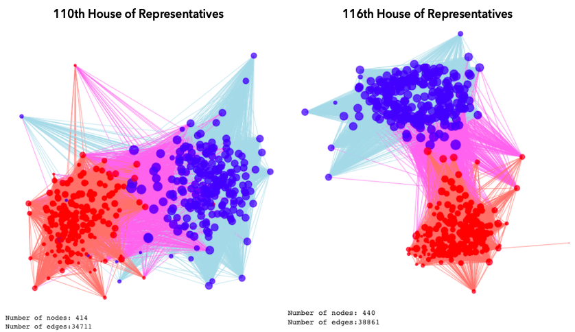

# Using Network Analysis and Natural Language Processing to help you understand the US Congress.

With the 2020 US election being close to finished, we once again find ourselves at the end of a long period of time where US politics has been on everyones lips. But for us Danes, the US political system can seem.. well, quite chaotic? In the light of the recent election, a term you might have heard come across is the United States Congress. Curious to know more about the US Congress - in particular the House of Representatives? Look no further!

On this website, we wish to give you an overview of the voting patterns in the US House of Representatives, and how it has changed over the past 13 years. In the bottom of the page, we will take you through a brief overview of how we found and processed the data, so you have the opportunity to become a US-Congress-Data-Master yourself when you are done reading this website. If you are not interested in the data, and solemnly want to know if there is chaos in congress or not, you can stop before the analysis section and stick to the visual representations of the analyses. Regardless of your technical interest, this website will provide you with answers to questions like: 

- Does polarization exist, and to what degree do the members agree with each other?
- Would a network divide the members into communities corresponding to their political party?
- What subjects separates communities in the House of Representatives? 
- And has this changed over time?

**Intrigued? Keep on reading for insights on our findings!** 

## Navigating the page 
1. [Context and termonology](#Context and termonology)
2. [Findings](https://github.com/benedictehejgaard/chaos-in-congress/blob/gh-pages/index.md#findings)
3. [Data Used](#The Data Used) 
4. [Network Analysis](#Network Analysis) (advanced)
5. [Text Analysis](#Text Analysis) (advanced)
6. [Download the Dataset](#Where do I find the data?) 
7. [Download the Entire Workbook](#Where do I find the master notebook that rigurously explains this entire analysis?)

## Context and termonology
Before we get started with the results, we realize not everyone is an expert in the US Congress. If you are, you can skip this section. 

The United States Congress consists of two parts; the house of representatives and the senate. This particular project is solely interested in the house of representatives, which is comprised of 435 members. Each house sits for a 2-year term, after which it is possible to be reelected (as most representatives do). The job of the representatives is to consider bill proposals and amendments in order to introduce new legislation in the United States. Each of these votes is referred to as a roll call and will be uniquely identified by the year and a roll call number (2020-10 will uniquely identify a roll call for example). If a bill is passed in the house of representatives, it is voted on in the senate and finally it is presented to the president. 

Below, you will find a simple overview of the above described termology: 

| Termonology    | Description                                                    |
|----------------|----------------------------------------------------------------|
| Representative | A voting member of the House of Representatives                |
| Term           | The two year period that the representatives are elected for   |
| Bill/Issue     | The law proposal/amendment that the house votes for            |
| Bill_ID        | Unique ID for each Bill/Issue                                  |
| Roll Call      | A round of voting for a bill. There can be multiple per bill.  |
| Roll_Call_ID   | Unique ID for a roll call.   

## Findings

Please note, a detailed and thorough explanation of the underlying steps, codes and analysis to produce all these findings can be found under [network analysis](#Network Analysis), [text analysis](#Text Analysis) as well at the [explainer notebook](#Where do I find the master notebook that rigurously explains this entire analysis?) (advanced). 

To examine whether polarization exists, we created a network of each representative, based on their voting pattern, using the *ForceAtlas2* library(TODO REF). Each node (the bubble) in the network represents a member of the House in the given term, and each edge (line between bubbles) represents a link between two members. Each time two members have voted *yes* for the same bill, they get a link, meaning that the "weights" each edge has depends on how much each member agress on bills with eachother. TODO Add about why some are further away. To reduce the density of the network while still remaining all information, we have used two approaces inspired by M. Ángeles Serrano et al. (2009)(TODO REF). Namely, setting a global minimum threshold for edgeweights, and using an algorithm to select significant edges based on edge weights. Please see advanced sections and the explainer notebook for further information. 

In the networks below, Democratic members have blue nodes, and a link between two democratic nodes are correspondingly blue. Republican members have red nodes, and a link between two Republican nodes are correspondingly red. If a Republican and a Democrat have a link between them, the link is colored purple. 

## The Data Used 

If you wish to dive deeper into the analyses behind these findings, you will first need some data. In order to carry out these investigations, you will need four datasets: 
* Congress_110_116: Congress Member Data
* roll_info: Roll Call Data
* issue_info: The summary for each bill/issue
* roll_call_vote: The result of each Roll Call voting round 

Each of these datasets contain data from the [US Congress Website](www.congress.gov). If you are curious to know exactly how we got the data, you can find a more throrough walk-through in our [webscraping notebook](https://nbviewer.jupyter.org/github/benedictehejgaard/chaos-in-congress/blob/gh-pages/Scraping_Congress.ipynb) that explains how we carried out the scrape. 

**Congress_110_116: Congress Member Data**

We use the dataset Congress_110_116 to gain an overview of all the members of the House of Representatives from terms 110-116. With the unique member_ID as a key, it contains information over the members of the congress since 2007, their political party, state, a URL to their website, and much more.

There are 435 members of the House of Representatives. It is to be noted that members do not necessarily sit in the house for the full period. We have a total of 969 members in the dataset – 500 republicans, 468 democrats, and one independent, with 10 variables before the initial datacleaning. This low number is due to the fact the fact that most representatives sit for longer than just a single term - they are typically re-elected for multiple terms. This dataset is 156 kB.

After cleaning, this dataset has 969 rows, corresponding to 969 members. 

**roll_info: Roll Call Data**

We use the dataset Roll_Info to gain an overview of all the Roll Call voting rounds that have been carried out. The Dataset uses the roll-id (Roll Call number and Year) as a unique key. Additionally, it contains information on each roll call in terms of the bill that was voted for, the date, the question that was asked, and the result of the voting round. Since each bill has mutiple roll calls, the same bill can be present multiple times.

The dataset also contains a variable labeled Issue_link which is a unique https link to the website of the bill voted for. Nice the worlds *bill* and *issue* are used interchangeably. The issue link will be key variable later, as it ties this dataset to the Issue_Info dataset, which is the dataset that contains the summaries of each bill. 

There are 9800 unique roll calls in total. The dataset is 3 MB.

We clean the data by removing all entries where either the bill ID or the result of the vote is missing. Furthermore, most bills that are presented in congress will have several votes, and only the latest vote is included in the analysis, such that each bill is represented by a single vote. Furthermore, if these were not removed, identical sumamries may appear in the text analysis which would skew the results. By only focusing on the last vote, we are sure to focus only on the longest and most accurate summary of each bill.

After data cleaning, the final dataset has 3082 Roll Calls and Bills (rows).

**issue_info: The summary for each bill/issue**

We use the dataset Issue_Info to gain the summaries for each bill. THe issue_link (described above) is the unique key for that issue/bill and each bill comes with a summary for that bill. This summary text will be used for the later text analysis. The dataset contains 4267 bills, and is 31 MB.

We clean the data by removing all empty summaries. After data cleaning, the final dataset has 3639 Roll Calls (rows). 

**roll_call_vote: The result of each Roll Call voting round**

We use the dataset Roll_Call_Vote to see what each member has voted at each roll call. It uses the member_ID as a unique key, and each column is a Roll_Call_ID. For each member for each key, the dataset will give the vote casted at each roll call by each representative. Notice, NaN is present if the member has not voted in that roll call. The dataset is 21 MB.

We remove all the Roll Calls that were not the latest roll call for a bill, so the list of roll calls correspond to the list of roll calls we obtained from the [roll_info](#roll_info: Roll Call Data) data cleaning. Furthermore, we notice there are multiple methods of answering; yes, yea, no, nay, thus the roll call votes are changed to binary. Notice all *not voting* and *NaN* values will be left out of this analysis:

* 1 for 'Yes', 'Yea', and 'Aye'
* 0 for 'No', and 'Nay'

After data cleaning, this dataset has the shape: Members (rows), Roll Calls (cols) = (916, 3082).

## Basic Statistics
When diving into the data, we quickly realize that voting pattern for each member varies greatly. Not all members vote for at each roll call. Furthermore, for the majority of the votes it is evident that the representatives either completely disagree (avg. vote around 0.5) or completely agree (avg. vote around 0.9-1.0). Some bills have an average of 1.0, meaning each voting representative has voted to pass the bill. 

The majority vote in the House of Representatives can play a major role in the outcome of a roll call. In the plot below, we have displayed the distribution of the representatives among the two parties:

We know that for the congress, which party is in the lead is a major factor in getting bills passed/not passed through. Hence, it is highly relevant to take this distribution of the members of the House of Representatives into consideration when examining the voting patterns over time. In the figure, we see that from terms 110-111 (2007-2010) and again in term 116 (2019-2020) there was an overweight of democrats in the House of Representatives, whereas from terms 112-115 (2011-2018) there was an overweight of Republicans. Interestingly enough, the majority party in the house is almost disproportinal with the party of the sitting United States President.

  
During 2007-2010 there was a significanly higher amount of bills being passed than in the following years. This could be tied to the distribution of the parties in those years. However, it is relevant to consider historic event as well, since these years fall during and after the financial crisis. We notice a drastic fall in number of bills proposed from 2010 to 2011, which is also the years that the house went from havign a democratic majority to a republican majority, all under a democratic President.

Each bill comes with a summary, but it can be non-trivial how long these summaries are. This perspective will be relevant in our later text analysis, thus we will generate some basic insights on the text that we gain from the summaries of the bills.

We see that most bills fall to the shorter end of the scale (notice the log-scale). A few summaries are of longer character. This will be taken into consideration in the later text analysis, as we wish to not assign more frequency to a certain words solemnly based on the fact that the summaries it is mentioned in, are longer than average.

Further basic statistics as well as a walk-through of how these were found can be found in the explainer notebook at the bottom of the page. 

## Network Analysis 

### Step 1 - Building the Network 

Before we are able to test our hypotheses, we have to build a network. As previously mentioned, we wish to create a network of representatives, connected by the roll calls they have voted for. We have tested several heuristics to achieve this goal. Prior to testing these, the data was manipulated to a desirable format to construct the edges. Namely, we are interested in constructing node-pairs and counting how often they agree/disagree on bills in the following ways:

* Agree yes: Both voting yes
* Agree no: Both voting no
* Agree: Total agree yes and agree no
* Disagree: One yes, one no

In the following, we will take you through a highlevel overview of the network analysis. If you wish to get an in-depth explanation of how this was carried out, along with the sequence of functions that were made to carry it out, you can download the Explainer Notebook below. 

-- Fill in about creating the network -- 

### Step 2 - Analyzing the Network 

This section has been divided into three steps for an easier walk-through.

Step 1: 
To further examine the defined graphs for each term in Analysis 1, the best partition (separation into smaller communities) of the nodes will be found using the Louvain heuristics algorithm from section "The Louvian algorithm" in the book http://networksciencebook.com/chapter/9#advanced-9c (TODO ref). The goal is to perform community detection which aims to uncover inherent community structure of the graphs.  Thus, the number and size of the communities are not predefined but needs to be found. 
This is done by creating a dendogram, which creates a tree where each level is a partition of the graph nodes. Level zero will be the first partition and contains the smallest communities. The best partition will be the highest level, and higher level results in bigger communities.  

The found communities will then be evaluated by calculating the modularity (a measure for how distinct the communities are) and by performing text analysis.  

Step 2:
When the partitions for each graph have been found, they can be evaluated by calculating the modularity using equation 9.12 from http://networksciencebook.com/chapter/9#modularity (TODO ref). Modularity is a measure of the quality of the partition. Therefore, the modularity is a method to decide if a community partition is better than other partitions. 
We will also use the modularity method as a comparison method between the graph from the different terms, as we interprets a high modularity as more distinct partitions. Thus, if there is a change from a low modularity to a higher throughout the terms, this could indicate that the congress has become more polarized.  

In the tabel below, we have indicated our measures for determining if a partition is good or not. We are basing these numbers off image 9.16 in http://networksciencebook.com/chapter/9#modularity TODO ref. These could also be derived for our example, using the formulas in the same chapter.

| Type                |  Description |
|---------------------|--------------|
| Optimal Partition   | - Higher modularity implies better partition, as the corresponding community structure is better. The optimal partition is set to 0.4 based on image 9.16  |
|---------------------|-----------------------------------------|
| Suboptimal Partition| - If the modularity is below the optimal value 0.4 but above zero, the partition fails to identity the correct communities. | 
|---------------------|-----------------------------------------|
| Single Community    | - This is when modularity is equal to zero,  which mean we assign all nodes to the same community. |
|---------------------|-----------------------------------------|
| Negative Modularity | - When each node is assigned to a different community, the modularity becomes negative.  |

Step 3: 
The last step was to visualize the graphs where node colors were be based on the partition instead of the party of the members. We were hoping to see a clear distinct between the partition where they have a higher modularity compared to those with a lower.

## Text Analysis 
he bill/issue summaries are used to perform text analysis by using the partition of the graph found in Analysis 2. This will hopefully help us to understand if there is a voting pattern over time for the partitions, as well as what topics each partitions stands for. The following steps are used to reach that goal.

Step 1:
Some data processing is necessary to extract the bill/issue summaries, which are more descriptive for the specific partitions. 

First, the voting for the rolls calls information is in the edges, as the edges between two nodes are the rolls calls they both have voted yes to, and the partition information is on the nodes. Thus, we need to extract the edges between two nodes, which are in the same partition. This will give extremely many roll calls with different occurrences, as only two members have to have voted yes for the roll call to be considered.  Therefore,  the roll calls will receive a weight in the form of their frequency to accommodate this problem as we are interested in the roll calls which they agree to vote yes to the most. This way we can extract the top quantile of roll calls which should be the ones which are most descriptive for the specific partitions.

Step 2: 
Now, the wanted roll calls have been found and their corresponding summaries, which we then have to clean before any text analysis can be performed. 

This is done by tokenize the summaries and then remove stop words, common bill words, years, punctuation and single characters to only include word, which should have more meaning in the summaries. 

Lastly, we want to investigate whether a stemming method should be used. In this project the result from the Porter Stemmer algorithm in the nltk package will be used.

Step 3: 
The Text Analysis can now be performed on the data. The end goal is to have a word cloud which reflects the most important words in the specific partition compared to the other partition in that term. We use term frequency-inverse document frequency (TF-IDF) to find the weighting factor for the words in the partition. 

The TF calculation is the number of times the word occurs in a partition divided with the number of words in the document, thus the value will increase proportionally to the number of times a word occurs. To adjust for words which occurs more frequently in general we use the IDF, which measures how much information a word provides. This is done by taking the logarithm of the number of partition divided with the number of documents containing the word, t. 

The TF-IDF formular is: 

**** INSERT FORMULAR **** 

TF * IDF 

Where f_t,d is the raw count of the word in a partition, N is the number of partitions and 𝑛𝑡 is the number of documents containing term t. 

It is also worth noting that we are currently operating on 'clean' text, however the IDF function indirectly handles stop words by assigning them a weight of 0, if they occur in all of the documents in question.

Step 4: 
The word cloud can now be generated based on the TF-IDF calculations for each partition in every term. This will hopefully visualised a distinct voting pattern for each partition over time. 

## Where do I find the data?
The four datasets used for the analyses can be downloaded from our github repository [here](data). 

TODO maybe add source?

## Where do I find the master notebook that rigurously explains this entire analysis? 
A full description of the entire analysis can be retrieved [here](https://nbviewer.jupyter.org/github/benedictehejgaard/chaos-in-congress/blob/gh-pages/WebsiteTest.ipynb). 

